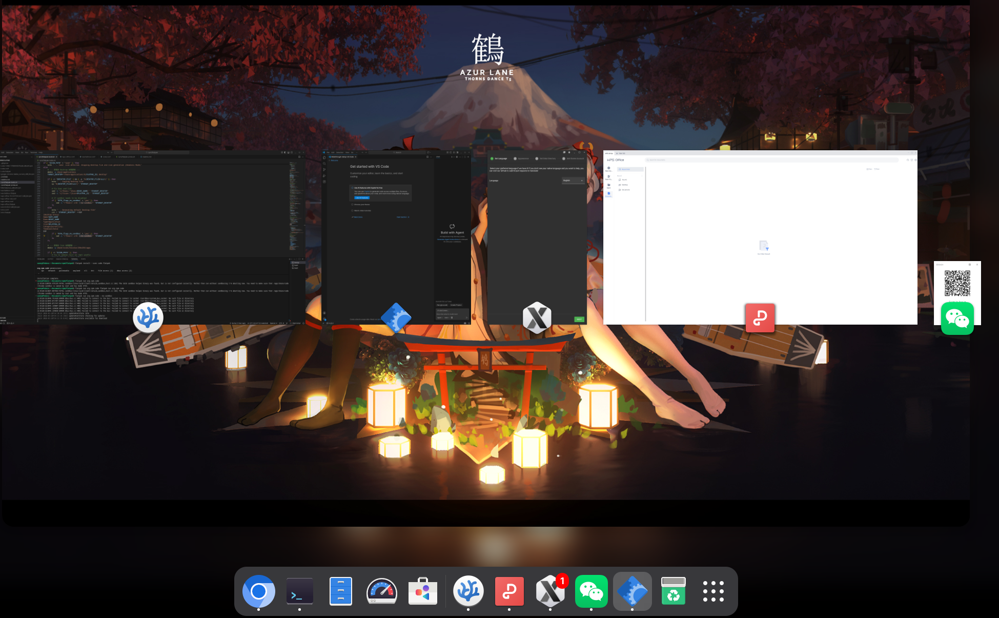

```
sunny@fedora:~$ flatpak list | grep rpm
code    org.rpm.code            master  code-origin     user
wechatlinux     org.rpm.wechatlinux             master  wechatlinux-origin      user
wps-office      org.rpm.wps-office              master  wps-office-origin       user
xmcl    org.rpm.xmcl            master  xmcl-origin     user
```

# RPM to Flatpak Converter

**Solving the 10-year RPM-to-Flatpak challenge with intelligent automation.**

A smart tool to convert RPM packages into Flatpak bundles with minimal effort. For over a decade, converting RPM packages to Flatpak has been a manual, error-prone process requiring deep knowledge of both packaging formats. This tool automates the entire workflow with intelligent detection and an interactive wizard.

This tool was developed with help of AI.

## Why This Tool?

The RPM-to-Flatpak conversion problem has existed since Flatpak's inception:
- **Manual complexity**: Requires understanding file layouts, desktop entries, dependencies
- **No standard workflow**: Each application needs custom handling
- **Wrapper scripts**: Hard to trace actual binaries from launcher scripts
- **Permission configuration**: Difficult to determine correct sandbox settings
- **Time-consuming**: Hours of trial-and-error for a single package

This tool solves all these issues with **automated detection** and **intelligent recommendations**.

## Features

- 🔍 **Intelligent Detection**: Automatically scans RPM contents and detects desktop files, executables, and icons
- 🎯 **Interactive Wizard**: Step-by-step guided process with smart recommendations
- 🔧 **Manual Override**: Enter container shell anytime for manual inspection and fixes
- 📦 **Wrapper Script Detection**: Automatically unwraps shell scripts to find real binaries
- ⚡ **Force Install Support**: Handles problematic RPMs with signature or dependency issues
- 🎨 **Complete Flatpak**: Generates proper desktop integration with icons and metadata
- 👻 **Headless Mode**: Option to skip desktop files and icons for headless applications
- 🔗 **Extra Repositories**: Add custom repositories during build for missing dependencies  
- ⚙️ **Custom Permissions**: Override default Flatpak permissions per application needs

## Requirements

- **podman**: Container runtime
- **flatpak**: Flatpak package manager
- **Fedora Runtime**: Uses automatic detection (`%fedora` macro) - requires matching Fedora runtime SDKs for your system version

Install Fedora runtime from official Fedora repository:
```bash
# Add Fedora Flatpak remote if not already added
flatpak remote-add --if-not-exists fedora oci+https://registry.fedoraproject.org

# Install Fedora Platform and SDK (Currently only works with rpm capable for fedora)
flatpak install fedora org.fedoraproject.Platform//f43
flatpak install fedora org.fedoraproject.Sdk//f43
```

## Quick Start

### 1. Probe and Generate Configuration

Run the probe script to analyze your RPM:

```bash
./rpm2flatpak-probe.sh /path/to/your-app.rpm
```

The wizard will guide you through:
1. **Desktop File Selection**: Choose the main .desktop entry
2. **Executable Selection**: Pick the primary binary (auto-detects from desktop file)
3. **Icon Selection**: Select application icon
4. **Runtime Flags**: Configure sandbox and environment settings

**Output**: A configuration file (e.g., `your-app.conf`)

### 2. Build Flatpak Package

Use the generated config to build the Flatpak:

```bash
./rpm2flatpak-build.sh your-app.conf
```

**Output**: `your-app.flatpak` bundle ready for installation

### 3. Install and Run

```bash
flatpak install --user your-app.flatpak
flatpak run org.rpm.your-app
```

## Advanced Usage

### Manual Container Exploration

During the probe wizard, press `e` at any step to enter the container shell:

```
Actions: [number] select, [s] skip/none, [e] manual explore, [m] manual input
Your choice > e
```

Inside the container, you can:
- Manually install the RPM: `rpm -ivh --nodeps --nosignature --nodigest /root/package.rpm`
- Explore the filesystem: `find /opt -name "*"`
- Check binary files: `file /usr/bin/app`
- Type `exit` to return to the wizard

### Configuration File Format

The generated `.conf` file contains all settings:

```ini
# RPM to Flatpak Configuration File
# Generated: Mon Jan 20 12:00:00 UTC 2025

[meta]
app_name=wps-office
rpm_file=wps-office-11.1.0.11723.XA-1.x86_64.rpm
force_install=yes

[desktop]
desktop_file=/usr/share/applications/wps-office-wps.desktop

[exec]
exec_path=/opt/kingsoft/wps-office/office6/wps
exec_name=wps

[icon]
icon_path=/usr/share/icons/hicolor/256x256/apps/wps-office2019-wpsmain.png

[flags]
no_sandbox=yes
extra_path=/opt/kingsoft/wps-office
extra_ld_path=/opt/kingsoft/wps-office/lib
```

You can manually edit this file before building.

### Force Install Mode

If automatic DNF installation fails (signature issues, missing dependencies), the probe will:
1. Automatically set `force_install=yes` in the config
2. The builder will use `rpm -ivh --nodeps --nosignature` instead
3. No need to pass `--force` flag manually

### Advanced Features

#### Headless Mode (No Desktop Icon)

For command-line tools or headless applications, skip desktop file and icon generation:

1. During the probe wizard, select `[n] none` when choosing an icon:
   ```
   Actions: [number] select, [a] use recommended, [n] none (no icon), [e] explore, [m] manual
   Your choice > n
   ```

2. The builder will detect `icon_path=none` and skip desktop/icon creation entirely

**Use Case**: CLI tools like databases, build systems, or background services that don't need desktop integration.

#### Custom Repositories Support

Add extra repositories during RPM installation for missing dependencies:

1. In the probe wizard "Runtime Flags" step:
   ```
   Extra Repos URL (e.g. https://.../foo.repo) - used during build:
   > https://example.com/repo/x86_64/
   ```

2. The builder will install `dnf-command(config-manager)` and add the repository before installing your RPM

**Use Case**: Applications requiring repos from third-party sources or enterprise repositories.

#### Custom Flatpak Permissions

Override default sandbox permissions for applications with special requirements:

1. In the probe wizard "Runtime Flags" step:
   ```
   Extra Flatpak Permissions (e.g. --device=all --filesystem=/tmp):
   > --device=dri --filesystem=/var/log/app
   ```

2. The builder will append these flags to `flatpak build-finish` command

**Use Case**: Applications needing access to specific devices, filesystem locations, or additional system resources.

**Example Configuration with All Features:**
```ini
[meta]
app_name=headless-cli
rpm_file=mytool-1.0-1.x86_64.rpm
force_install=yes
extra_repos=https://enterprise.repo.com/stable/

[desktop]
desktop_file=

[exec] 
exec_path=/usr/bin/mytool
exec_name=mytool

[icon]
icon_path=none

[flags]
no_sandbox=no
extra_permissions=--device=dri --filesystem=/opt/data
```

## How It Works

### Probe Phase (rpm2flatpak-probe.sh)

1. Creates a temporary Fedora container
2. Attempts to install the RPM with DNF
3. If installation fails, prompts for manual handling
4. Scans installed files using `podman diff`
5. Detects:
   - Desktop files in `/usr/share/applications`
   - ELF binaries in `/usr/bin`, `/usr/sbin`, `/opt`
   - Icons in `/usr/share/icons` and `/usr/share/pixmaps`
6. Analyzes desktop files to extract recommended executables
7. Unwraps shell wrapper scripts to find real binaries
8. Generates configuration file

### Build Phase (rpm2flatpak-build.sh)

1. Reads configuration from `.conf` file
2. Installs RPM in a new container (using force mode if needed)
3. Extracts changed files using `podman diff`
4. Flattens directory structure (`/usr/*` → `/app/*`, `/opt/*` → `/app/*`)
5. Creates symlinks for executables in `/app/bin`
6. Processes desktop files and icons
7. Configures Flatpak permissions and environment
8. Exports to OSTree repository
9. Bundles into `.flatpak` file

## Examples

### WPS Office

```bash
# Probe
./rpm2flatpak-probe.sh wps-office-11.1.0.11723.XA-1.x86_64.rpm

# Select desktop: wps-office-wps.desktop
# Auto-detected exec: /opt/kingsoft/wps-office/office6/wps
# Select icon: wps-office2019-wpsmain.png
# Enable --no-sandbox: yes

# Build
./rpm2flatpak-build.sh wps-office.conf
```

### Electron Apps

For Electron-based applications, the probe automatically:
- Detects Electron runtime (checks for `electron`, `chrome-sandbox`)
- Suggests enabling `--no-sandbox` flag
- Adds proper environment variables

## Troubleshooting

### "No file changes detected"

The RPM installation failed silently. Solutions:
1. Press `e` during probe to enter container
2. Manually install with: `rpm -ivh --nodeps --nosignature --nodigest /root/package.rpm`
3. Type `exit` to continue

### "Cannot locate executable file"

The executable path changed during flattening. Solutions:
1. Check the config file's `exec_path`
2. Use manual exploration (`e`) to find the correct path
3. Edit the `.conf` file manually

### Missing Dependencies at Runtime

Add required libraries to the config:
```ini
[flags]
extra_ld_path=/app/lib:/app/custom-libs
```

### Desktop File Not Working

Verify in the config:
- `desktop_file` points to a valid `.desktop` file
- `exec_name` matches the launcher in `/app/bin`

## Permissions

The builder sets these Flatpak permissions by default:
- Network access (`--share=network`)
- X11 and Wayland display (`--socket=x11`, `--socket=wayland`)
- Audio (`--socket=pulseaudio`)
- GPU acceleration (`--device=dri`)
- File chooser portal access
- D-Conf settings (read-only)

## Limitations

- Only supports x86_64 architecture
- Requires Fedora 43 base image
- Some complex applications may need manual tweaking

## Contributing

Feel free to submit issues or pull requests for improvements.

## License

This tool is provided as-is for converting RPM packages to Flatpak format.

## Acknowledgments

- Uses Fedora container base
- Built on Podman and Flatpak technologies
- Inspired by the need to run proprietary RPM applications in sandboxed environments
